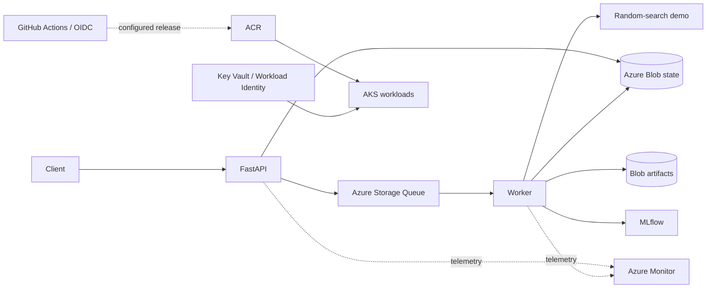
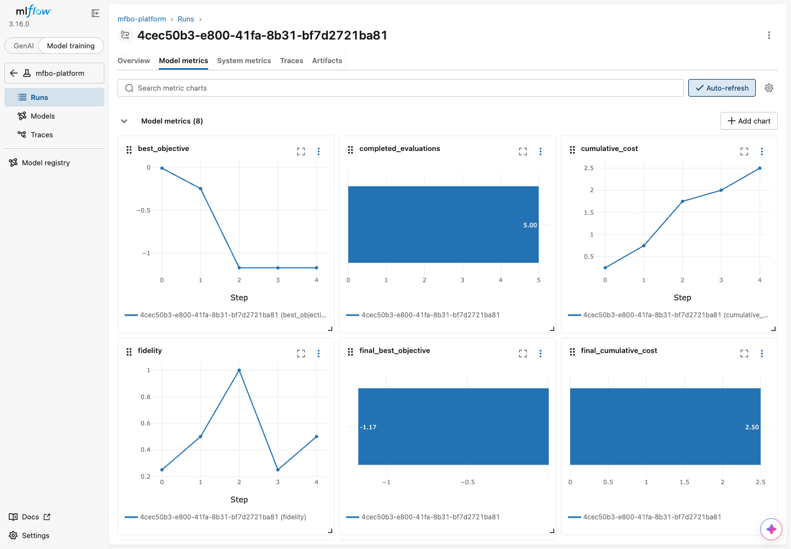

# Azure ML Optimization Platform

A cloud-native platform for asynchronous optimization jobs: **FastAPI, durable workers,
Azure Blob/Queue Storage, MLflow, Docker, Kubernetes, and GitHub Actions**.

This public edition runs a seeded random-search demo on the standard Hartmann6 function.
It demonstrates ML engineering, not a Bayesian optimization algorithm or research-quality
improvements. The original research system is maintained separately and is not distributed.

## Quick start

Install Docker with Compose, Python 3.12, and uv 0.7.5. From the repository root:

```bash
make install
make verify
docker compose up -d --build --wait --wait-timeout 180
curl -f http://localhost:18080/ready
make smoke
```

Open [API docs](http://localhost:18080/docs) and [MLflow](http://localhost:15500).
Stop with `make docker-down`; data volumes are retained.
The demo has its own Compose project and ports so it can run beside another local stack.

## Architecture



The API returns a job ID immediately. Workers execute jobs independently, publish progress,
and persist results. Expiring ownership leases prevent stale workers from overwriting
accepted results. The queue is at-least-once; retries may repeat computation.

API replicas handle request traffic. Worker replicas increase concurrent jobs, not the
speed of an individual run. Read the [architecture guide](docs/ARCHITECTURE.md).

## Try the API

```bash
curl -X POST http://localhost:18080/experiments \
  -H 'Content-Type: application/json' \
  -H 'Idempotency-Key: demo-42' \
  -d '{"benchmark":"hartmann6","strategy":"random","budget":10,"fidelities":[0.5,1.0],"seed":42,"max_iterations":5}'
```

Use the returned ID in these routes:

| Method | Route | Purpose |
| --- | --- | --- |
| GET | `/experiments/{id}` | Status, progress, cost, and configuration |
| GET | `/experiments/{id}/metrics` | Recorded history |
| GET | `/experiments/{id}/recommendation` | Best observed candidate |
| POST | `/experiments/{id}/cancel` | Request cancellation |
| GET | `/health` | Process health |
| GET | `/ready` | Dependency readiness |

The demo's fidelity setting controls a synthetic bias and cost label, not real evaluation
quality. Recommendations report the fidelity at which they were observed.
On Azure, experiment endpoints require `X-API-Key`.

## Engineering features

- Strict request validation, idempotency keys, bounded jobs, and safe failure summaries.
- Durable state, retries, cooperative cancellation, and dispatch recovery after interruption.
- Filesystem storage or Azure Blob; Azurite exercises the cloud SDKs locally.
- MLflow parameters, metrics, completion state, and result summaries; Blob result artifacts.
- Structured logs, Prometheus metrics, health probes, and optional Azure telemetry.
- Non-root API/worker containers, Kubernetes resources, and Bicep infrastructure.
- CI for lint, typing, tests, Docker smoke checks, and infrastructure compilation.
- Optional OIDC deployment that builds only this repository's demo images.

## Verification and limitations

See [verification](docs/VERIFICATION.md) for this export's actual checks.
The predecessor engineering platform was deployed on AKS; **this public edition has not
been deployed to Azure**. It has no research engine, model-training dependencies, or private
adapter. Do not claim research results from this demo.

The manifests use an internal API and single-replica SQLite MLflow. High availability,
cloud scaling gains, verified telemetry ingestion, and GitHub-executed releases remain
outside the verified scope. Internet exposure needs authenticated TLS ingress and stronger
identity controls. MLflow outage repair remains manual.

## Screenshots and deployment evidence

See the [evidence gallery](docs/EVIDENCE.md) for Azure, Kubernetes, Docker, and MLflow.
Azure/Kubernetes evidence belongs to the predecessor deployment; Docker/MLflow show this
public demo locally. The gallery distinguishes actual UI screenshots from formatted reports.



## Guides

- [Recreate locally and deploy to Azure](docs/RECREATE.md)
- [Cost tables](docs/COSTS.md)
- [Operations](docs/OPERATIONS.md)
- [GitHub setup](docs/GITHUB.md)
- [Security and publication](docs/SECURITY.md)
- [Infrastructure benchmarks](docs/BENCHMARKING.md)

Next engineering steps: verify a demo release on AKS, exercise telemetry and alerts, and
measure scaling using a documented workload. None requires publishing the research engine.
