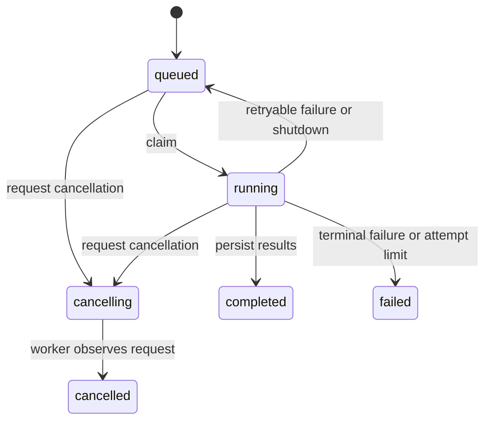

# Architecture and job lifecycle

## Component responsibilities

| Component | Responsibility |
| --- | --- |
| FastAPI | Validate requests, create durable state, and return a job ID |
| Azure Storage Queue | At-least-once message delivery with renewable visibility |
| Worker | Claim ownership, execute a job, persist results, and acknowledge delivery |
| Engine interface | Accept typed configuration, emit metrics, and check cancellation/shutdown |
| Demo engine | Seeded random sampling on Hartmann6 with synthetic fidelity labels |
| Blob Storage | Shared state, configuration snapshots, result JSON, and convergence plots |
| MLflow | Parameters, step metrics, lifecycle tags, and summary artifacts |

The demo is not Bayesian optimization. Replacing it requires an independently implemented
engine and deliberate schema changes, not access to unpublished code.

## Lifecycle

Cancellation is durable. The demo checks cancellation and shutdown between iterations.
A queued cancellation is finalized when a worker consumes the message.

## Reliability tradeoffs

Workers renew both queue visibility and a persisted ownership lease. Expired owners cannot
commit metrics or terminal state. Metrics and progress share one atomic state update;
Blob ETags retry conflicting writes. Attempt-specific artifact paths prevent stale overwrites.

Accepted state also records pending dispatch. Idle workers reconcile unsent jobs every
30 seconds. Duplicate sends are tolerated. All-busy workers defer reconciliation.
This simple scan should become an indexed outbox at larger scale.

Retries restart the seeded job; there is no checkpoint recovery or exactly-once execution.
Acknowledgement errors preserve completed state. Tracking failures are marked in state;
results survive, but MLflow reconciliation is manual.

## Scaling and storage

API CPU autoscaling is configured; worker count is fixed until measured queue-depth scaling
is added. More workers run more jobs concurrently. They do not accelerate a single run.

Local filesystem state needs a shared POSIX volume; independent AKS pods use Blob.
Embedding history in the state blob simplifies atomicity but increases write volume.
MLflow uses SQLite and one persistent disk: this is a small evaluation deployment, not HA.
