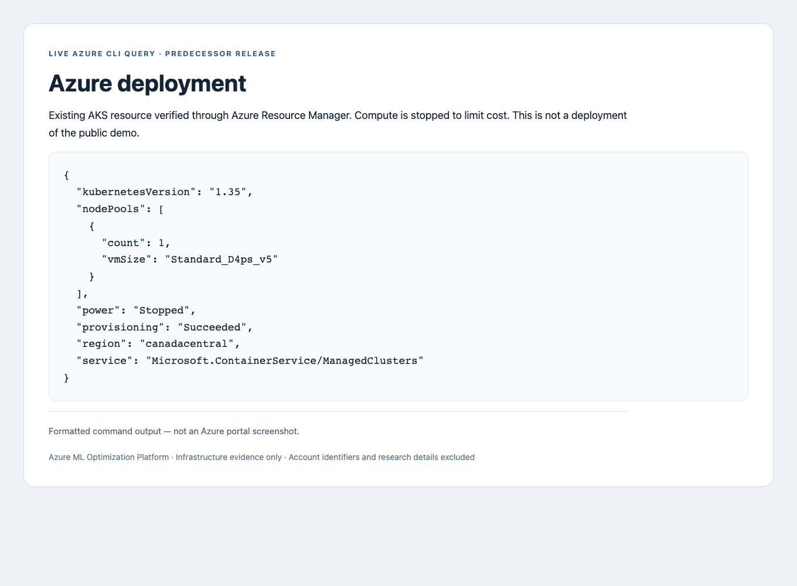
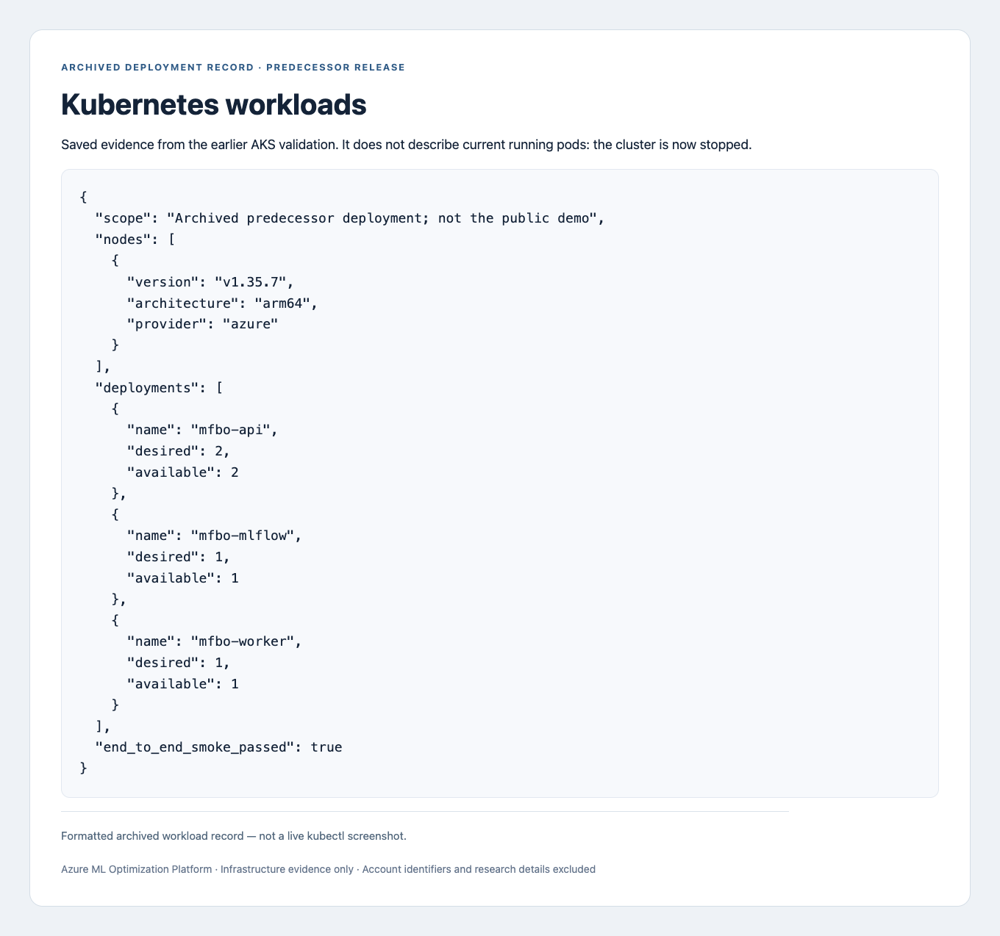
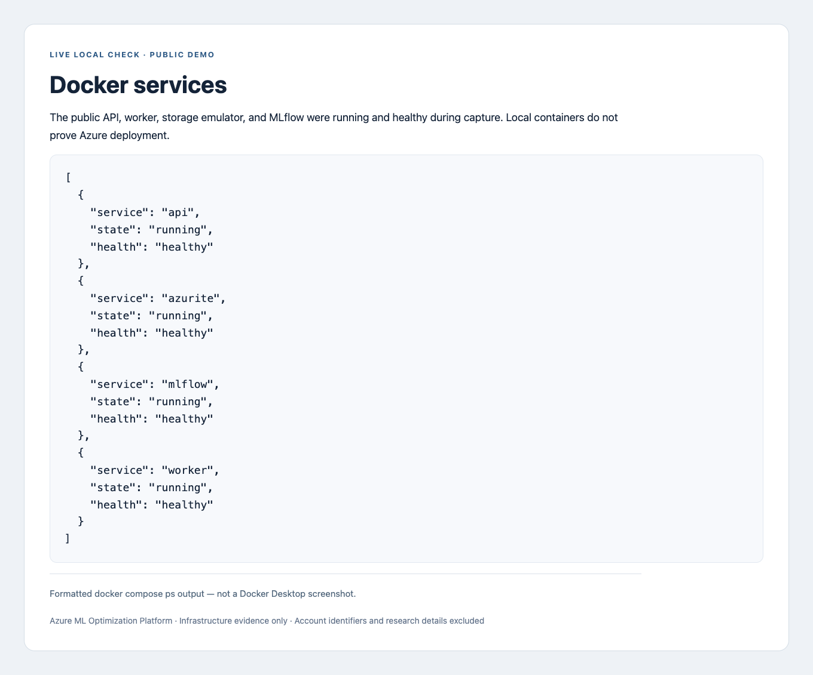

# Deployment evidence

These images distinguish the earlier Azure deployment from the local public demo.
The public edition itself has not been deployed to Azure.

| Capture | Source | What it establishes |
| --- | --- | --- |
| Azure | Live, read-only Azure CLI query | The original AKS resource exists, provisioning succeeded, and compute is stopped |
| Kubernetes | Saved workload record from the earlier deployment | API, worker, and MLflow replicas were available during that validation |
| Docker | Live local Compose status | The public demo containers were running and healthy |
| MLflow | Actual local MLflow UI | A completed public demo run has stored metric history |

The MLflow image is an actual application screenshot. The other three images are
**formatted evidence reports**, not screenshots of Azure Portal, Docker Desktop, or a
live Kubernetes terminal. Their displayed values come from the stated sources.

## Azure: existing AKS deployment



[Sanitized query output](evidence/azure-deployment.json).
The stopped state is intentional cost control; it does not mean workloads are running now.
The query did not start compute or modify cloud resources.

To repeat the read-only check, substitute your resource group and cluster:

```bash
az aks show --resource-group RESOURCE_GROUP --name AKS_NAME \
  --query '{service:type,region:location,provisioning:provisioningState,power:powerState.code,kubernetesVersion:kubernetesVersion,nodePools:agentPoolProfiles[].{count:count,vmSize:vmSize}}' \
  --output json
```

## Kubernetes: archived deployment validation



[Sanitized workload record](evidence/kubernetes-deployment.json).
This is an archived record from the predecessor release, not a live pod check or evidence
that the public demo was deployed. Resource identifiers, image references, and private
workload details were excluded; deployment replica counts were preserved.

## Docker: public demo on the local machine



[Sanitized container status](evidence/docker-services.json).
Captured after starting the public Compose stack. Those temporary containers were stopped
after capture; their data volumes were retained. Reproduce with:

```bash
docker compose up -d --no-build --wait --wait-timeout 120
docker compose ps
```

Use `--build` instead of `--no-build` if the images have not been built locally.

## MLflow: real public-demo metrics


This screenshot comes directly from the local MLflow model-metrics tab. The optional
assistant panel was closed through the UI. It shows only a public random-search demo;
the visible objective values and synthetic fidelity labels are not research results.
The visible run identifier belongs to the demo, not a confidential experiment.

To repeat: run `make smoke`, open [local MLflow](http://localhost:15500), choose
**Model training → mfbo-platform → a completed run → Model metrics**, and capture that view.

## Sharing safely

No account IDs, login details, registry addresses, source fingerprints, exact dates, or
confidential research settings are included in these published captures. Do not substitute
raw screenshots from another environment without reviewing them.

These captures support bounded deployment and operation claims—not high availability,
cloud scaling gains, or research-performance improvements. A successful GitHub release
run and a separately verified public-demo Azure deployment remain future checks.
